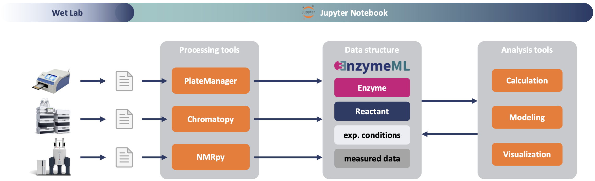

# EnzymeML Training Course

## ℹ️ About
The EnzymeML Training Course is a collaborative project between multiple biocatalysis groups. This project aims to jointly develop computational tools, data standards, and best practices for the analysis of enzyme-catalyzed reactions. Furthermore, the project provides training for Python-based data analysis of experimental data.

## 🚀 Motivation
The current processing and analysis of catalytic data mainly relies on spreadsheet-based tools. Thus, many manual processing steps are required, which are error-prone and time-consuming. The goal of this project is to develop generic Python tools that allow the processing and analysis of reaction data in Jupyter notebooks. Therefore, the MTPHandler and Chromatopy are developed, enabling the processing of raw data from spectrophotometry and chromatography. These tools act as data harmonization tools, allowing the conversion of raw data into the standardized EnzymeML format while enriching the measured data with metadata on e.g. reaction conditions or catalyst and substrate properties.

## 📚 Stages
The project is structured into three stages, dividing the task of implementing generic analysis workflows for biocatalytic data:  

### 1. Making experimental data accessible
Development of generic Python tools, allowing reading in unprocessed data from various analytical sources such as spectrophotometry, chromatograph, or NMR. The tools facilitate the preprocessing of the data, concentration calculation, and the generation of EnzymeML files.

### 2. Data Analysis
Depending on the needs of the project members, existing Python tools will be used or extended to analyze the data. Experimental questions 
Development of Python-based tools for the analysis of enzyme-catalyzed reactions.  

### 3. In-person Workshop
During a three-day workshop, the project members will be trained in the use of the developed tools and their implementation in Jupyter notebooks to form custom analysis workflows.