# EnzymeML Training Course

## 🚀 Motivation
The current processing and analysis of catalytic data mainly relies on spreadsheet-based tools. Thus, many manual processing steps are required, which are error-prone and time-consuming and not scalable. The goal of this project is to develop generic Python tools that allow the processing and analysis of catalyzed reaction data in Jupyter Notebooks. Jupyter Notebooks provide an interactive environment where code, data, and documentation coexist seamlessly, making it easy to experiment with data processing and analysis in real-time. This ensures that the entire workflow is transparent, reproducible, and easily shareable with others. Therefore, the Python tools `chromatopy`, `MTPHandler` and `NMRpy` are developed, enabling the processing of raw data from plate readers and chromatographic instruments. These tools act as data harmonization tools, allowing the conversion of raw data into the standardized EnzymeML format while enriching the measured data with metadata on e.g. reaction conditions or catalyst and substrate properties. Thereafter, the data is ready for further analysis, such as yield, conversion, selectivity determination, kinetic modeling, and visualization in a streamlined and reproducible manner.

The following diagram illustrates the workflow for each of the analytical instruments and the optional subsequent data analysis steps:

```mermaid
graph LR
    LAB["<b>📙 Lab Journal</b><br><br>
    <i>pH</i><br>
    <i>Temperature</i><br>
    <i>Reaction Time</i><br>
    <i>Initial Conditions</i><br></i>"]
    A[🌈 Chromatographic Instrument] -->|output| A1[📄 Files]
    B[🔬 Plate Reader] -->|output| B1[📄 Files]
    C[🧲 NMR] -->|output| C1[📄 Files]
    LAB -->|fill out form| SUITE

    A1 -->|read| D
    B1 -->|read| E
    C1 -->|read| F

    subgraph in Jupyter Notebook:
        subgraph EnzymeML Python Tools
            D{chromatopy}
            E{MTPHandler}
            F{NMRpy}
        end
        D -->|transform| EMLD[EnzymeML Object]
        E -->|transform| EMLD
        F -->|transform| EMLD
        EMLD -.-> DS1
        EMLD <-.-> DS2
        EMLD -.-> DS3
        subgraph with Data Science Python Tools:
            DS1[Determine e.g., yield, conversion, selectivity]
            DS2[Kinetic Modeling]
            DS3[Visualization]
        end
    end
    EnzymeMLDocument["<b>📄 EnzymeML Document</b><br><br>
    <i>SmallMolecules</i><br>
    <i>Proteins</i><br>
    <i>Measurements</i><br>
    <i>Reactions</i>"]

    SUITE["<b>🗂️ EnzymeML Suite</b><br><br>
    <i>create</i><br>
    <i>edit</i><br>
    <i>simulate</i><br>
    <i>visualize</i><br></i>"]

    SUITE <--->|read / write| EnzymeMLDocument

    EMLD <-->|read / write| EnzymeMLDocument
```

