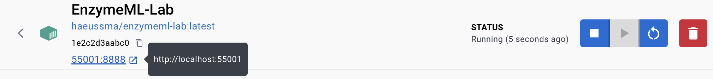

## Setting up EnzymeML Lab

Jupyter Notebook is a web-based interactive computing environment that allows you to create and share documents that contain live code, equations, visualizations, and narrative text. It is a great tool for data analysis and visualization. 

1. Install [Docker]
  [Docker]: docker_installation.md

2. Open the Docker Desktop application search for `haeussma/enzymeml-lab` in the upper search bar and click on `RUN`.

    

    The container will be downloaded and a configuration window will be opened.
    

3. Configure the container in the `Run a new container` window as follows in the `Optional settings` section.
    In the `Volumes` section set the `Host path` to the folder, which should be accessible from JupyterLab. If in doubt specify your home directory.

    


4. within the `Logs` of the container, you will find a token, which is needed to access the Jupyter Notebook. 

    ```bash
    2024-02-25 17:44:54 [I 2024-02-25 16:44:54.937 ServerApp]     http://127.0.0.1:8888/lab token=a9a39e2f219edac28f66cf2c88a9954978f78626e58e03f6
    2024-02-25 17:44:54 [I 2024-02-25 16:44:54.937 ServerApp] Use Control-C to stop this server and shut down all kernels (twice to skip confirmation).
    2024-02-25 17:44:54 [C 2024-02-25 16:44:54.939 ServerApp] 
    2024-02-25 17:44:54     
    2024-02-25 17:44:54     To access the server, open this file in a browser:
    2024-02-25 17:44:54         file:///home/jovyan/.local/share/jupyter/runtime/jpserver-7-open.html
    2024-02-25 17:44:54     Or copy and paste one of these URLs:
    2024-02-25 17:44:54         http://e2376db8149d:8888/lab?token=a9a39e2f219edac28f66cf2c88a9954978f78626e58e03f6
    2024-02-25 17:44:54         http://127.0.0.1:8888/lab?token=a9a39e2f219edac28f66cf2c88a9954978f78626e58e03f6
    2024-02-25 17:44:55 [I 2024-02-25 16:44:55.984 ServerApp] Skipped non-installed server(s): bash-language-server, dockerfile-language-server-nodejs, javascript-typescript-langserver, jedi-language-server, julia-language-server, pyright, python-language-server, python-lsp-server, r-languageserver, sql-language-server, texlab, typescript-language-server, unified-language-server, vscode-css-languageserver-bin, vscode-html-languageserver-bin, vscode-json-languageserver-bin, yaml-language-server
    ```

    In the example above, the token is `a9a39e2f219edac28f66cf2c88a9954978f78626e58e03f6`.

5. Click on the link in the header of the container to open the JupyterLab in your default web browser.

    


6. Enter the token from the logs in the field `Token` and click on `Log in`.

7. You are now in the JupyterLab environment your local files can be accessed via the `work` folder.

## Stopping the Container

To stop the container, click on the `Stop` icon in the `Docker Desktop` application. You will find it in the `Containers` section. Running containers are symbolized by a green container icon.

## Restarting the Container

To restart the container, click on the `Start` icon in the `Docker Desktop` application. You will find it in the `Containers` section. Stopped containers are symbolized by a red container icon. The klick on the blue port number next to the start icon. You may need to copy the access token from the logs again. You find the logs by clicking on the container name in the `Containers` section. 