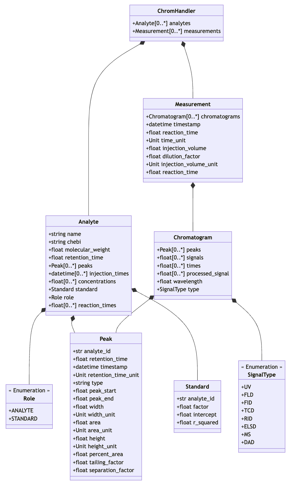

In this section, we will go through the basic concepts of Python programming and how to load and manipulate data in Python. Then, we will load chromatographic data and perform basic operations on the data.

## Data Structures in Python

Python has several built-in data structures that can be used to store and manipulate data. The most common data structures are:

- **String**: A string is a collection of characters. Strings are defined by single quotes `''` or double quotes `""`. Strings can be used to e.g. define the path to a file, or to assign a literal value to a variable.
```python
# Defining a name as a string
reactant_name = "D-Glucose"

# Defining a file path as a string
file_path = "data/2021-01-01_experiment.txt"
```

- **Integer / Float**: An integer is a whole number, positive or negative, without decimals, of unlimited length. Integers or floats can be used to store numerical values e.g. the initial concentration of a reactant or the temperature of a reaction.
```python
# Defining the initial concentration
init_conc = 3.2

# Defining the temperature
temperature = 37
```

- **List**: A list is a collection of items that are ordered and changeable. Lists are defined by square brackets `[]`. Lists can be used to e.g. store the reaction time points.
```python
# Defining a list of time points
reaction_time = [0, 5, 10, 15, 20]
```

- **Dictionary**: A dictionary is a collection of items that are unordered, changeable, and indexed. Dictionaries are defined by curly brackets `{}`. Dictionary items are in the form of key-value pairs. Dictionaries can be used to store metadata about the reaction conditions.
```python
# Defining a dictionary of reaction conditions
reaction_conditions = {
    "temperature": 37,
    "temp_unit": "C",
    "pH": 7.0,
    "init_conc": 3.2,
    "conc_unit": "mmol/l"
}
```


The defined data structure can be printed using the `print()` function for visualization. For example:
```python
print(reactant_name)
print(file_path)
print(reaction_time)
```
results in:
```text
> D-Glucose
> data/2021-01-01_experiment.txt
> [0, 5, 10, 15, 20]
```

!!! Example
    Open a Jupyter Notebook eighter via the EnzymeML-Lab Docker container or with a different Python environment. And define the data structures mentioned above. Print the defined data structures.
    

## Manipulation of data in a `List`

Lists are the most important data structure to organize reaction data of different time series or experimental series. The following operations can be performed on lists:

- **Accessing Elements**: Elements in a list can be accessed by their index. The index starts at 0 for the first element.
```python
# Accessing the first element of the list
print(reaction_time[0])
```

- **Appending Elements**: Elements can be added to the end of a list using the `append()` method.
```python
# Appending a new time point to the list
reaction_time.append(100)
print(reaction_time)
```
```text
> [0, 5, 10, 15, 20, 100]
```

- **Removing Elements**: Elements can be removed from a list using the `remove()` method.
```python
# Removing the element 5 from the list
reaction_time.remove(5)
print(reaction_time)
```
```text
> [0, 10, 15, 20, 100]
```

!!! Example
    Define a list of time points and perform the operations mentioned above in various ways. Print the list after each operation to see the changes.

## Objects in Python

In Python, everything is an object. An object is an instance of a class, and a class is a blueprint for objects. Objects can have attributes (data) and methods (functions). This is the basis of object-oriented programming as well as the basis for using and manipulating data with EnzymeML tools. All EnzymeML tools are based on objects that can be used to load, manipulate, and analyze data. In the following diagram, the object model of Chromatopy is visualized. It shows the relations and connections between the different objects. Each object has attributes, which are variables of basic data types (e.g. strings, integers, lists) or other objects. If an attribute can occur multiple times, it is represented as a list. In the diagram, list attributes are marked with `[0..*]`. 

{: style=height:700px; width:100px;}

## Loading and process chromatographic data
!!! Example
    In the next step, we will apply the introduced concepts to process chromatographic data. Therefore, load the [`shaimadzu-example`](https://github.com/haeussma/shimadzu-example) dataset and follow the steps to load, annotate, calibrate, visualize, and export chromatographic data in the prepared `calibration.ipynb` notebook.

    If in doubt about the steps to start the EnzymeML-Lab Docker container, or how to load the dataset, please refer to the [Getting Started](getting_started.md) section.