# Availabe tools for processing of experimental data

## From Raw Experimental Data to EnzymeML-Driven Analysis

Processing experimental data for analysis is often a complex and error-prone task. Typically, raw data from lab instruments such as plate readers, chromatographs, and NMR devices must be manually extracted, cleaned, and reformatted before analysis can begin. This process is time-consuming and not scalable.

To streamline this workflow, Python tools such as chromatopy, MTPHandler, and NMRpy have been developed. These tools enable direct reading of raw data files from experimental instruments, automating the transformation into a structured format that is immediately usable for analysis.

## Data Processing Workflow

Raw data is read directly from files generated by lab instruments and transformed into EnzymeML documents. EnzymeML provides a standardized structure for storing key reaction data, including reaction conditions, catalysts, and substrate properties. This ensures that data is well-organized, FAIR-compliant, and ready for computational analysis.

Within a Jupyter Notebook environment, these tools allow seamless integration of data processing, analysis, and visualization. The entire workflow—from raw data ingestion to structured analysis—is transparent, reproducible, and easy to share with others.

## From Raw Data to Analyzable Data

Once experimental data has been transformed into EnzymeML format, it becomes the foundation for further data science applications:

- Yield, conversion, and selectivity calculations
- Kinetic modeling and reaction simulations
- Comprehensive visualization of experimental results

The following diagram shows the workflow from raw data to analyzable data in form of an EnzymeML Document:

```mermaid
graph LR
    A[🌈 Chromatographic Instrument] -->|output| A1[📄 Files]
    B[🔬 Plate Reader] -->|output| B1[📄 Files]
    C[🧲 NMR] -->|output| C1[📄 Files]

    A1 -->|read| D
    B1 -->|read| E
    C1 -->|read| F

    subgraph in Jupyter Notebook:
        subgraph Experimental Data Processing
            D{chromatopy}
            E{MTPHandler}
            F{NMRpy}
        end
        D -->|transform| DataObject[EnzymeML Object]
        E -->|transform| DataObject
        F -->|transform| DataObject
        DataObject -.-> DS1
        DataObject <-.-> DS2
        DataObject -.-> DS3
        subgraph with Data Science Python Tools:
            DS1[Determine e.g., yield, conversion, selectivity]
            DS2[Kinetic Modeling]
            DS3[Visualization]
        end
    end
    DataObject -->|transform| ExperimentalDocument
    ExperimentalDocument["<b>📄 EnzymeML Document</b><br><br>
    <i>Small Molecules</i><br>
    <i>Proteins</i><br>
    <i>Measurements</i><br>
    <i>Reactions</i>"]
```

## 🔬 Photometric Data

The [MTPHandler](https://fairchemistry.github.io/MTPHandler/) Python library streamlines the processing of photometric data from plate readers. It enables reading, processing, and exporting data from a variety of plate reader formats, blank correction, and concentration calculation in a scalable way.

## 🌈 Chromatographic Data

The [Chromatopy](https://fairchemistry.github.io/Chromatopy) Python library streamlines the processing of chromatographic time-course data. It enables reading, processing, and exporting data from a variety of chromatographic instruments, assignment of retention times to molecules, and concentration calculation in a scalable way.

## 🧲 NMR Data

The [NMRPy](https://nmrpy.readthedocs.io/en/latest/) Python library streamlines the processing of NMR time-course data.