# Hackathon: Managing Your Own Data with EnzymeML Tools

This session is designed to familiarize participants with the EnzymeML tools through an interactive workshop. It begins with an introduction to the EnzymeML Suite, a comprehensive grapgical application for creating and visualizing EnzymeML documents. The session will also highlight interoperability with various libraries, showcasing integrations with tools like MTPHandler, NMRPy, and Catalax to enhance versatility and functionality. Thereafter, brought datasets will be read in, with the EnzymeML tools [`chromatopy`](https://fairchemistry.github.io/chromatopy/) for chromatographic measurements, [`MTPHandler`](https://fairchemistry.github.io/MTPHandler/), as well as [`nmrpy`](https://nmrpy.readthedocs.io/en/latest/?badge=latest)

## Requirements

To participate in the hands-on session, the following hardware and software are required:

- **Laptop** with an up-to-date operating system (e.g., recent Windows, macOS, or Linux operating system)
- [**Anaconda** installation](https://docs.anaconda.com/anaconda/install/):

Anaconda simplifies installing and managing Python, Jupyter, and essential tools. It bundles everything you need, including numerous libraries, making it perfect for beginners and advanced users.

### Python Libraries

For this session, the following Python libraries will be used, each serving a specific purpose:

- **Chromatopy**  
  A versatile library used for processing chromatographic data.

- **MTPHandler**  
  A library for handling data from microtiter plate (MTP) readers. It supports various file formats and provides tools for data processing.

- **NMRPy**  
  A library that facilitates the analysis of Nuclear Magnetic Resonance (NMR) data. It helps in spectral processing, visualization, and interpretation of (time-course) NMR experiments.

- **Catalax**  
  A computational library for simulating catalytic processes and enzyme-catalyzed reactions based on JAX. Catalax offers tools for integration, parameter estimation and neural ordinary differential equations.

- **Basico/COPASI**  a
  Basico is a Python interface for COPASI, a widely-used software for simulating and analyzing biochemical networks. Basico provides Pythonic access to COPASI’s features, such as simulating models, parameter estimation, and sensitivity analysis.

Installation of the required libraries will be covered during the workshop.

### Bringing Your Own Data

If you plan to utilize your own data, please refer to the following list of supported devices and file formats. However, if you don't have your own data that meets these requirements, you can use prepared datasets provided during the workshop.

- __Plate reader data__  
    please refer to the supported formats in the [documentation of `MTPHandler`](https://fairchemistry.github.io/MTPHandler/#supported-plate-readers)
- __Chromatographic data__  
    please refer to the supported formats and data preparation in the [documentation of `chromatopy`](https://fairchemistry.github.io/chromatopy/supported_formats/)
- __NMR data__  
    FIDs of NMR measurements (e.g., Bruker, Varian)

You should also bring data from calibration measurements if applicable for your data analysis.

## Agenda

The hackathon session will start with an introduction in the EnzymeML Suite and how it can be used to capture an experiment with its graphical user interface. Thereafter, either onw datasets or prepared data sets can be processed with the EnzymeML Python tools in a Jupyter Notebook therefore the mentioned Anaconda installation is required. The following workflow illustrates the steps for each of the supported analytical instruments and the optional subsequent data analysis steps:

```mermaid
graph LR
    LAB["<b>📙 Lab Journal</b><br><br>
    <i>pH</i><br>
    <i>Temperature</i><br>
    <i>Reaction Time</i><br>
    <i>Initial Conditions</i><br></i>"]
    A[🌈 Chromatographic Instrument] -->|output| A1[📄 Files]
    B[🔬 Plate Reader] -->|output| B1[📄 Files]
    C[🧲 NMR] -->|output| C1[📄 Files]
    LAB -->|fill out form| SUITE

    A1 -->|read| D
    B1 -->|read| E
    C1 -->|read| F

    subgraph in Jupyter Notebook:
        subgraph EnzymeML Python Tools
            D{chromatopy}
            E{MTPHandler}
            F{NMRpy}
        end
        D -->|transform| EMLD[EnzymeML Object]
        E -->|transform| EMLD
        F -->|transform| EMLD
        EMLD -.-> DS1
        EMLD <-.-> DS2
        EMLD -.-> DS3
        subgraph with Data Science Python Tools:
            DS1[Determine e.g., yield, conversion, selectivity]
            DS2[Kinetic Modeling]
            DS3[Visualization]
        end
    end
    EnzymeMLDocument["<b>📄 EnzymeML Document</b><br><br>
    <i>SmallMolecules</i><br>
    <i>Proteins</i><br>
    <i>Measurements</i><br>
    <i>Reactions</i>"]

    SUITE["<b>🗂️ EnzymeML Suite</b><br><br>
    <i>create</i><br>
    <i>edit</i><br>
    <i>simulate</i><br>
    <i>visualize</i><br></i>"]

    SUITE <--->|read / write| EnzymeMLDocument

    EMLD <-->|read / write| EnzymeMLDocument
```

